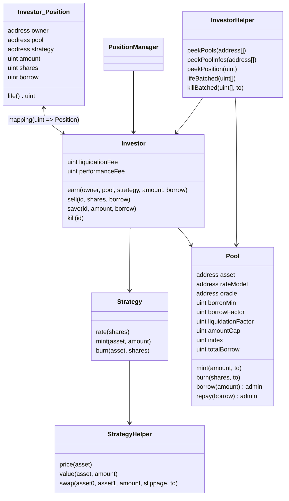

## Rodeo Contracts

### Introduction

Rodeo is a leveraged farming protocol initially deployed to Arbitrum.
It has it's own lending pools, liquidations and vetted strategy adapters.

### Overview

**Architecture**



**Contracts**

- `Investor.sol` Main contract allowing the borrowing of assets in `Pool`s for use with `Strategy`s. Liquidations also happen here.
- `Pool.sol` Lending pool contract allowing liquidity provider to lend assets in exchange for yield. Borrow and repay are only accessible to the `Investor.sol` contract. Deployed once per supported asset (and then whitelisted in the `Investor.sol` contract)
- `StrategyN.sol` Various strategies implement the logic for taking in any supported pool asset and investing it. `mint()` and `burn()` are only callable by the `Investor.sol` contract. `mint()` returns a share amount. `burn()` takes a share amount and returns an asset amount. `rate()` allows `Investor.sol` to evaluate the current value of a position and, in turn, it's health
- `PositionManager.sol` ERC721 NFT contract that wraps `Investor.sol` methods. Preferred way of interacting with the protocol for end users. The frontend uses this contract
- `StrategyHelper.sol` Contains a mapping of oracles and a mapping of swap routes for supported asset pairs. Used by strategies to easily value asset and swap assets while accounting for slippage
- `InvestorHelper.sol` Utility contract used by the frontend to batch view calls into one RPC request. Also used by the liquidation bot to batch check position's `life()` and batch `kill()` ignoring errors

**Privileged Roles**

All permissioned contracts use a simple mapping of addresses that have admin access. For some contracts it's used to allows configuration. For other it's to limit which other contract can call certain methods. In most cases it's used for both of those.

1. `Investor.sol` Can configure paused state, available pools, available strategies, various fees
1. `Pool.sol` Can configure paused state, minimum borrow, borrow factor, liquidation factor, amount cap, rate model contract and oracle used in liquidations. Can also withdraw from accumulated reserves
1. `StrategyN.sol` Can configure paused state, default slippage and sometimes a few other variables as needed
1. `StrategyHelper.sol` Can configure the oracles and swap venues and paths strategies use

### Testing and Developing

**Dependencies: Installing forge**

```
curl -L https://foundry.paradigm.xyz | bash
foundryup
```

**Running tests**

```
forge test
```

**Deploying contracts**

After seting up the private key environment variable and adjusting the `DeploySingle.s.sol` contract to deploy the contracts needed, use:

```
make deploy-single-mainnet
```

**Deploying to local Anvil node**

```
anvil # in separate tab
make deploy-local
```

Public key: `0xf39Fd6e51aad88F6F4ce6aB8827279cffFb92266`

Private key to add to Metamask: `0xac0974bec39a17e36ba4a6b4d238ff944bacb478cbed5efcae784d7bf4f2ff80`

**Call `file` with the right `what` (bytes32)**

```
> ethers.utils.hexlify(ethers.utils.toUtf8Bytes("strategies"))
0x73747261746567696573
```

**Get current Solc version for verify call**

```
$ ~/.svm/0.8.15/solc-0.8.15 --version
Version: 0.8.15+commit.e14f2714.Darwin.appleclang
```

**Verify: Passing in constructor array arguments**

```
cast abi-encode "constructor(address[])" "[0x123,0x456]"
```

### Deployments / Contract addresses

See [`deployment.md`](./deployment.md) for contract addresses.

### Audits and Security

**Audits:** Smart contracts have been audited by Kalos. These audit reports are made available under the `audits/` folder.

**Scope:** There is an active bug bounty for issues which can lead to substantial loss of money, critical bugs such as a broken live-ness condition, or irreversible loss of funds. 

**Disclosure:** Let us know as soon as possible upon discovery of a potential security issue. Provide us a reasonable amount of time to resolve the issue before any disclosure to the public or a third-party.

**Exclusions:** Already known vulnerabilities. Vulnerabilities in front-end code not leading to smart contract vulnerabilities.

**Contact:** To resposibly report a security issue message [@FarmerCarlton](https://t.me/FarmerCarlton) or [@jimbojangles](https://t.me/jimbojangles) on Telegram. Or email farmercarlton@proton.me with the subject "RODEO VULNERABILITY".

### License

MIT
